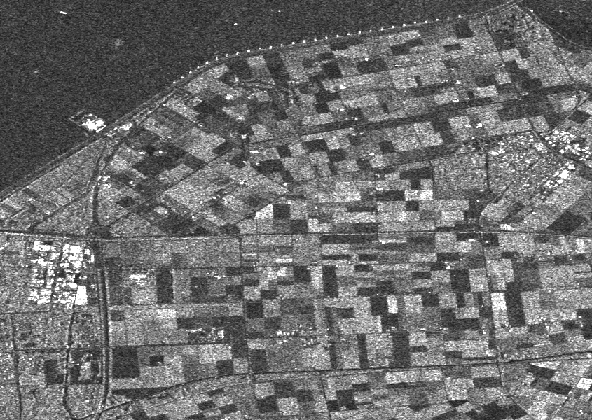
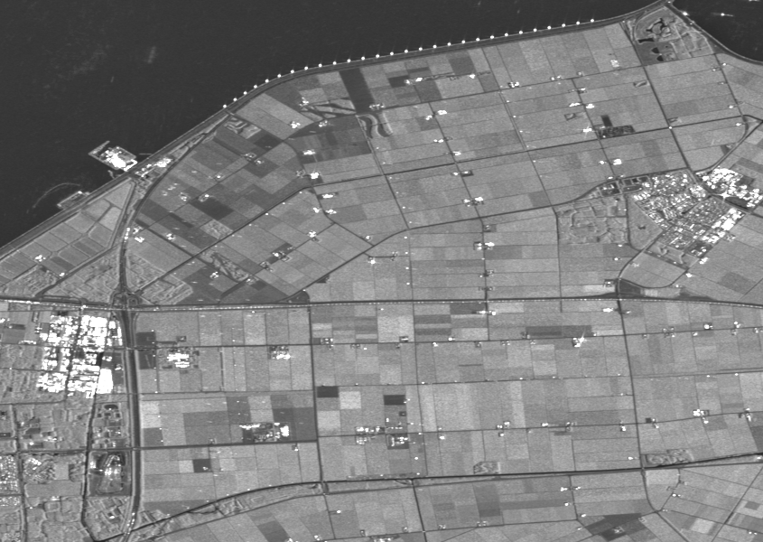

# Multitemporal-SAR-image-denoising
RABASAR denoising performance

Noisy image:

Denoised image:

Temporal average image:

Reference:

Zhao, W., Deledalle, C.A., Denis, L., Maître, H., Nicolas, J.M. and Tupin, F., 2019. Ratio-based multitemporal SAR images denoising: RABASAR. IEEE Transactions on Geoscience and Remote Sensing, 57(6), pp.3552-3565.

MuLoG code is needed, you can downloaded it from: https://www.charles-deledalle.fr/pages/mulog.php
